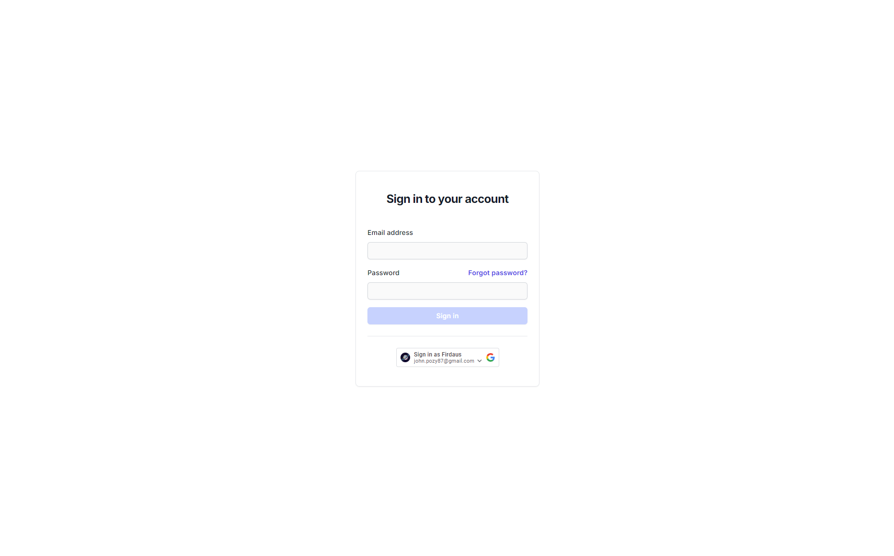

# Zurich Assessment
This code is part of Zurich Fullstack Senior Developer assessment and it will cover both the API and the WEB. Using NX monorepo to manage the project.

## Prerequisites

- Node.js v22.11.0
- Docker with docker-compose
- Yarn

## Technologies
### API
- NestJS
- PostgreSQL
- PGAdmin
- Docker

### WEB
- NextJS
- TailwindCSS
- Redux Toolkit
- Redux Persist

## Before Starting
Before starting, make sure the source code is cloned and the dependencies are installed. It's recommended to use yarn as the package manager.

1. Clone the repository
    ```bash
    git clone https://github.com/johnpozy/zurich-assessment.git
    ```
2. Navigate to the project directory
    ```bash
    cd zurich-assessment
    ```
3. Install dependencies
    ```bash
    yarn install
    ```
4. Start the PostgreSQL database using Docker
    ```bash
    docker compose up -d
    ```

## Project Structure

```
├── apps/
│   ├── api/          # NestJS API application
│   ├── api-e2e/      # API end-to-end tests
│   ├── web/          # NextJS web application
│   └── web-e2e/      # Web end-to-end tests
├── libs/
│   ├── api/
│   │   ├── auths/    # Authentication library
│   │   ├── products/ # Products library
│   │   ├── users/    # Users library
│   │   └── utils/    # Shared utilities
│   └── web/
│       ├── auths/    # Web authentication library
│       ├── users/    # Web users library
│       └── utils/    # Web shared utilities
```

## API
The API is built with NestJS and it's using PostgreSQL as the database. Running the API locally requires Docker to be installed. 

### Local Development
Once the API is running, the Swagger API documentation will be available at `http://localhost:5000/api/docs`


Start the API development server:
```bash
yarn start:api
```

### Testing Using Swagger
Below are sample users for testing and a list of available endpoints.

#### Example Users
There are two example users for testing. Use the following credentials to login:

| ID | Username | Password | Role  |
|----|----------|----------|-------|
| 1  | admin    | password | admin |
| 2  | user     | password | user  |

#### Available API Endpoints
- `GET /products` - Get all products
- `POST /products` - Create a new product
- `PUT /products` - Update a product
- `DELETE /products` - Delete a product
- `POST /auth/login` - User login
- `POST /auth/register` - User registration

## WEB
The WEB is built with NextJS and it's using TailwindCSS for styling. The WEB is using Redux Toolkit for state management and Redux Persist for persisting the state to local storage.

### Local Development
Start the WEB development server:
```bash
yarn start:web
```

The web application will be available at `http://localhost:3000`



